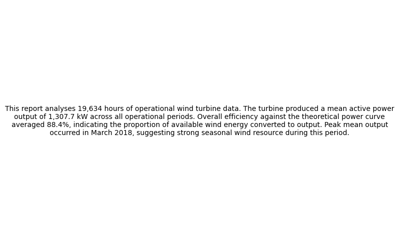
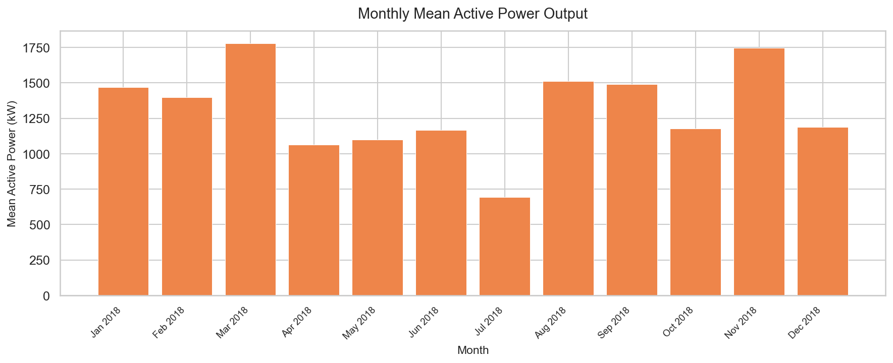
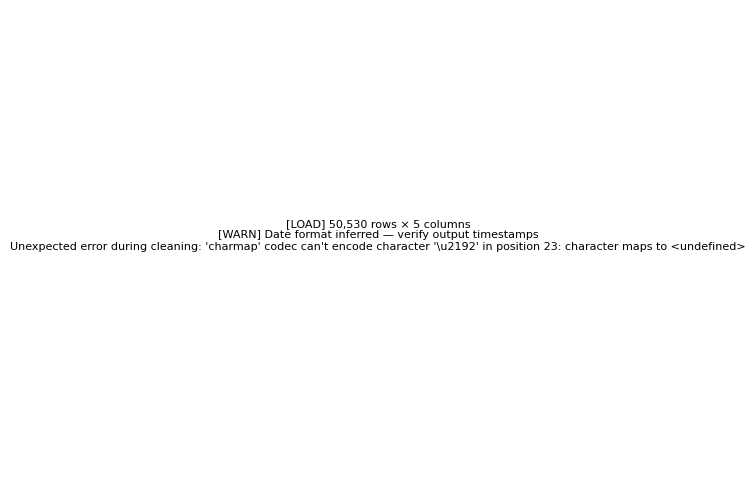

# Energy Operations Data Dashboard


A schema-agnostic Python pipeline that ingests operational SCADA data
from CSV files — Wind Turbine or Solar Power Generation — cleans and
validates it, runs structured analysis including anomaly detection,
and exports a multi-sheet Excel report and a self-contained shareable
HTML report, both with embedded charts and plain-English summaries.
The pipeline computes efficiency against reference benchmarks,
generates time-series and distribution visualisations, flags
anomalous readings using statistical and rolling-window methods, and
maintains an append-only audit log keyed by run ID across every
execution — directly mirroring data workflows used in real energy
operations. Built as a self-directed portfolio project to demonstrate
practical ETL, data cleaning, analysis, and reporting skills using
industry-standard Python tooling.

---

## Output Preview





---

## Stack

| Layer        | Technology            | Role                                          |
| ------------ | ---------------------- | --------------------------------------------- |
| Language     | Python 3.10+           | Runtime, orchestration, all pipeline logic    |
| Data         | Pandas 2.x              | Loading, cleaning, grouping, aggregation      |
| Charting     | Matplotlib + Seaborn   | Figure generation and `.png` export           |
| Excel export | openpyxl 3.x            | Workbook assembly, sheet writing, image embed |
| HTML export  | base64 (stdlib)         | Self-contained single-file report generation  |
| Testing      | pytest                  | Automated regression coverage                 |
| CLI          | argparse (stdlib)      | Argument parsing — no extra dependency        |

---

## Install

**1. Clone the repo**

```bash
git clone https://github.com/Blvckpanda/energy-data-dashboard.git
cd energy-data-dashboard
```

**2. Create and activate a virtual environment**

```bash
# Using venv
python -m venv .venv
.venv\Scripts\activate        # Windows
source .venv/bin/activate     # macOS / Linux

# Or using Anaconda
conda create -n energy-dashboard python=3.11
conda activate energy-dashboard
```

**3. Install dependencies**

```bash
pip install -r requirements.txt
```

**4. Add your dataset**

Place a SCADA CSV file in the `data/` folder. Two schemas are supported:

**Wind Turbine schema:**

| Column | Type |
| ------ | ---- |
| `Date/Time` | datetime |
| `LV ActivePower (kW)` | float |
| `Wind Speed (m/s)` | float |
| `Theoretical_Power_Curve (KWh)` | float |
| `Wind Direction (degrees)` | float |

Dataset: [Wind Turbine SCADA Dataset](https://www.kaggle.com/datasets/berkerisen/wind-turbine-scada-dataset)

**Solar Power schema:**

| Column | Type |
| ------ | ---- |
| `DATE_TIME` | datetime |
| `PLANT_ID` | string |
| `SOURCE_KEY` | string |
| `DC_POWER` | float |
| `AC_POWER` | float |
| `DAILY_YIELD` | float |
| `TOTAL_YIELD` | float |

Dataset: [Solar Power Generation Data](https://www.kaggle.com/datasets/anikannal/solar-power-generation-data)

## Run with Docker

No local Python setup required.

**Build:**

```bash
docker build -t energy-dashboard .
```

**Run (PowerShell):**

```powershell
docker run --rm `
  -v ${PWD}/data:/app/data `
  -v ${PWD}/output:/app/output `
  -v ${PWD}/logs:/app/logs `
  energy-dashboard --file data/turbine.csv
```

**Run (bash):**

```bash
docker run --rm \
  -v $(pwd)/data:/app/data \
  -v $(pwd)/output:/app/output \
  -v $(pwd)/logs:/app/logs \
  energy-dashboard --file data/turbine.csv
```

---

## Usage

**Single file (wind schema — default):**

```bash
python main.py --file data/turbine.csv
```

**Solar schema:**

```bash
python main.py --file data/solar.csv --schema solar
```

**Batch mode — process all CSVs in a folder:**

```bash
python main.py --folder data/ --schema wind
```

**Choose report format:**

```bash
python main.py --file data/turbine.csv --format html   # HTML only
python main.py --file data/turbine.csv --format both   # Excel + HTML
```

**Help:**

```bash
python main.py --help
```

**Example terminal output:**

```
[LOAD] 52,608 rows × 5 columns
[CLEAN] 52,608 rows in → 52,543 rows clean (65 dropped)
[ANALYSE] 3,226 rows excluded from efficiency (zero theoretical or non-positive output)
[ANALYSE]
[DETECT] 47 anomalies flagged (12 threshold, 35 rolling window)
[VISUALISE]
  Chart saved → output\charts\power_trend.png
  Chart saved → output\charts\wind_scatter.png
  Chart saved → output\charts\monthly_bar.png
  Chart saved → output\charts\anomaly_timeline.png
[EXPORT]
Report saved → output\report_2026-07-30.xlsx
```

---

## Output

**`output/report_YYYY-MM-DD.xlsx`** — seven-sheet Excel workbook:

| Sheet | Contents |
| ----- | -------- |
| Summary | Narrative paragraph + headline statistics |
| Clean Data | Full cleaned dataset, plain-English headers |
| Trend Analysis | Monthly mean and daily total aggregations |
| Efficiency Analysis | Per-row efficiency/conversion ratios |
| Charts | All four embedded chart images |
| Anomaly Report | Flagged anomalous readings with detection method |
| Data Quality Log | Cleaning decisions for this run, keyed by `run_id` |

**`output/report_YYYY-MM-DD.html`** — self-contained single-file
report with the same narrative, statistics, and charts embedded as
base64 images. Opens offline, shareable as one file, deployable to
GitHub Pages.

**`output/charts/`** — four standalone chart images:

| File | Chart |
| ---- | ----- |
| `power_trend.png` | Daily power output over time |
| `wind_scatter.png` | Output vs secondary metric, with reference line |
| `monthly_bar.png` | Monthly mean power output |
| `anomaly_timeline.png` | Power trend with anomalies highlighted |

**`logs/data_quality.log`** — append-only CSV audit log, keyed by
`run_id` and `run_timestamp` across every run.

---

## Pipeline Architecture

The pipeline is schema-agnostic, driven by a `SCHEMA_REGISTRY` in
`config.py` that tells every module which columns, thresholds, and
labels apply for the active `--schema`. Each module owns exactly one
responsibility and is independently importable. `main.py` is the
only file that imports from all other modules.

```
CSV file(s)
    │
    ▼
ingest.py ──── Schema validation against SCHEMA_REGISTRY
    │
    ▼
clean.py ───── Dedup → type coercion → null handling → date parse
    │                └── logs/data_quality.log (append-only)
    ▼
analyse.py ─── Stats · Efficiency · Monthly · Daily · Distribution
    │
    ▼
detect.py ──── Threshold + rolling-window anomaly detection
    │
    ▼
visualise.py ── Trend · Scatter · Bar · Anomaly timeline → *.png
    │
    ├──▶ export.py ──────▶ output/report_YYYY-MM-DD.xlsx
    └──▶ html_export.py ─▶ output/report_YYYY-MM-DD.html
              (both use narrative.py for shared summary text)
```

**Invariants the codebase never violates:**
- Input files in `data/` are never modified
- `logs/data_quality.log` is append-only — never truncated
- No column name or path string appears outside `config.py`
- No Python traceback ever reaches the user
- Output filenames always include an ISO date timestamp
- All schema differences live in `SCHEMA_REGISTRY` — no scattered
  `if schema == "wind"` branches outside genuinely structural cases

---

## Testing

```bash
pip install -r requirements-dev.txt
pytest
```

See `tests/` for coverage of schema validation, cleaning rules,
efficiency exclusion logic, and anomaly detection — plus an
end-to-end smoke test that runs the full pipeline on synthetic data.

---

## Project Structure

```
energy-data-dashboard/
│
├── main.py               # CLI entry point and pipeline orchestrator
├── ingest.py              # CSV loading and schema validation
├── clean.py                # Data cleaning and quality logging
├── analyse.py              # Statistics, aggregations, efficiency
├── detect.py                # Anomaly detection (threshold + rolling)
├── visualise.py            # Chart generation (.png export)
├── export.py                 # Excel workbook assembly
├── html_export.py            # Self-contained HTML report assembly
├── narrative.py              # Shared narrative text generation
├── config.py                  # All constants + SCHEMA_REGISTRY
├── requirements.txt           # Pinned runtime dependencies
├── requirements-dev.txt       # Testing dependencies
├── CLAUDE.md                  # AI agent context and workflow rules
│
├── tests/                     # pytest test suite
├── data/                      # Input CSV files (gitignored)
├── output/                    # Generated reports and charts (gitignored)
├── logs/                      # data_quality.log (gitignored)
├── docs/screenshots/          # README images
│
└── context/                   # Architecture and specification docs
    ├── project-overview.md
    ├── architecture.md
    ├── code-standards.md
    ├── ai-workflow-rules.md
    ├── progress-tracker.md
    └── feature-specs/
        └── unit-01-spec.md ... unit-12-spec.md
```

---

## Development Process

This project was built using a spec-driven, incremental workflow —
twelve build units, each fully specified before any code was written,
with explicit done-when checklists and architecture invariants
enforced throughout. The `context/` folder contains the full set of
living documents that defined the project at every stage: architecture
decisions, code standards, a decisions log, and individual spec files
per unit.

---

## License

MIT
